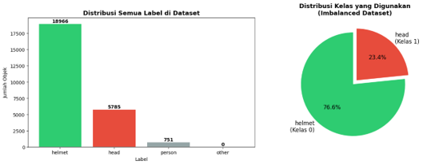
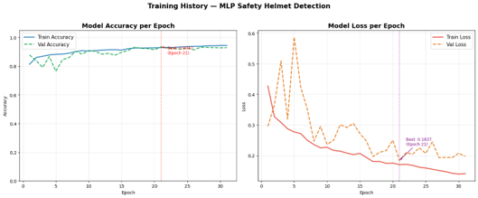
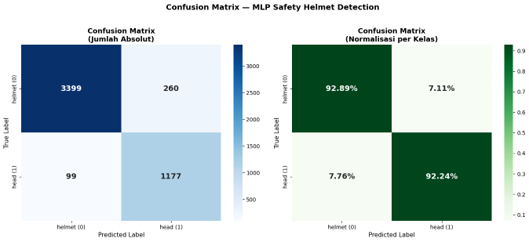
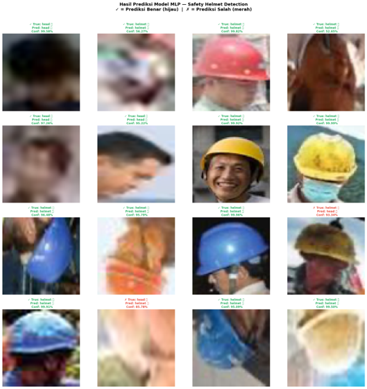

# ⛑️ Worker Safety Helmet Detection using Multi-Layer Perceptron (MLP)

## 📌 Project Overview

This project aims to develop a **Worker Safety Helmet Detection** system using a **Multi-Layer Perceptron (MLP)** model. The objective is to classify whether a detected worker is **wearing a safety helmet** or **not wearing a safety helmet** based on cropped object images extracted from annotated bounding boxes.

Instead of performing object detection directly, this project focuses on **helmet classification** by utilizing the annotated bounding boxes provided in the dataset. Each object is cropped, preprocessed, and used as input for the MLP classifier.

The project follows a complete machine learning pipeline consisting of:

- Dataset Preparation
- Exploratory Data Analysis (EDA)
- XML Annotation Parsing
- Image Cropping & Preprocessing
- Train-Test Split
- Class Weight Calculation
- Multi-Layer Perceptron (MLP) Modeling
- Model Training
- Training Visualization
- Model Evaluation
- Prediction Visualization
- Model Saving

---

# 📂 Project Structure

```text
WorkerSafetyHelmetDetection/
│
├── helmet_detection.ipynb          # Main notebook
├── hard-hat-detection/             # Dataset
│   ├── images/
│   ├── annotations/
│   └── classes.xml
├── mlp_helmet_detector_final.keras # Trained MLP model
├── helmet_class_names.pkl          # Class labels
├── README.md
└── requirements.txt
```

---

# 📖 Dataset

The project uses the **Hard Hat Detection Dataset**, which contains construction worker images accompanied by XML annotation files describing object locations and helmet labels.

Instead of using the entire image, each annotated worker is cropped based on the bounding box coordinates to improve classification performance.

## Classes

The dataset consists of two primary classes:

- **Helmet**
- **No Helmet**

Each cropped image is resized before being used for training.

---

# ⚙️ Machine Learning Pipeline

## 1. Dataset Preparation

The dataset is first organized by reading image files and their corresponding XML annotations.

The project performs:

- Dataset directory inspection
- XML annotation validation
- Image-annotation pairing
- Dataset configuration

The dataset configuration includes:

- Image size: **64 × 64**
- RGB channels
- Random seed
- Batch size
- Training parameters

---

## 2. Exploratory Data Analysis (EDA)

Before training, exploratory analysis is performed to understand the dataset.

The EDA includes:

- Dataset folder structure
- Number of images
- Number of annotation files
- Class distribution
- Sample annotated images
- Bounding box visualization

This stage helps verify dataset consistency before preprocessing.

---

# 📸 Exploratory Data Analysis

## Class Distribution



Visualization showing the number of samples for each class.

---

# 🔍 XML Parsing & Bounding Box Extraction

The dataset provides annotations in XML format.

Each XML file is parsed to extract:

- Image filename
- Object label
- Bounding box coordinates
  - xmin
  - ymin
  - xmax
  - ymax

The extracted coordinates are used to crop only the worker region from the original image.

This significantly reduces background noise and allows the classifier to focus on the safety helmet.

---

# 🖼️ Image Preprocessing

Each cropped object undergoes several preprocessing steps:

- Bounding box cropping
- Image resizing (64×64)
- RGB conversion
- Pixel normalization
- Flattening into one-dimensional vectors

The resulting vectors become the input features for the MLP classifier.

---

# 📊 Dataset Splitting

To avoid **data leakage**, the dataset is split based on **unique image filenames** instead of cropped samples.

This ensures that objects from the same original image never appear in both the training and testing datasets.

Additionally, **class weights** are calculated to reduce the impact of class imbalance during training.

---

# 🤖 Multi-Layer Perceptron (MLP)

The classification model is built using a **Pyramid Architecture Multi-Layer Perceptron**.

The architecture includes:

- Input Layer
- Multiple Hidden Layers
- ReLU Activation
- Dropout Layers
- L2 Regularization
- Softmax Output Layer

The model is designed to reduce overfitting while maintaining good classification performance.

---

# 🔍 Training Strategy

The model training incorporates several optimization techniques:

- Feedforward Propagation
- Backpropagation
- Adam Optimizer
- EarlyStopping
- ModelCheckpoint
- Class Weight Balancing

EarlyStopping automatically stops training when validation loss no longer improves, preventing unnecessary epochs and reducing overfitting.

---

# 📈 Training Performance

Training performance is monitored using:

- Training Accuracy
- Validation Accuracy
- Training Loss
- Validation Loss

These metrics help evaluate the convergence and stability of the learning process.

---

# 📸 Training Visualization

## Accuracy Curve & Loss Curve



Training and validation accuracy & Loss over epochs.

---

# 📊 Model Evaluation

After training, the model is evaluated using the testing dataset.

The evaluation metrics include:

- Accuracy
- Precision
- Recall
- F1-Score
- ROC-AUC Score

A confusion matrix is also generated to visualize classification performance for each class.

---

# 📸 Evaluation Results

## Confusion Matrix



The confusion matrix illustrates correct and incorrect classifications for both helmet and no-helmet classes.

---

## Classification Report

The classification report summarizes:

- Precision
- Recall
- F1-Score
- Support

for each class.

---

# 🔮 Prediction Visualization

The trained model is tested on unseen images from the testing dataset.

Several random cropped worker images are displayed along with:

- Ground Truth Label
- Predicted Label
- Prediction Confidence

This visualization provides qualitative insight into the model's prediction capability.

---

# 📸 Detection Results

## Helmet Detection Samples



Example predictions generated by the trained MLP classifier on unseen testing samples.

---

# 💾 Model Saving

After achieving satisfactory performance, the trained model is saved as:

```text
mlp_helmet_detector_final.keras
```

The class names are also stored separately to simplify future inference.

---

# 🚀 Getting Started

## 1. Clone Repository

```bash
git clone https://github.com/username/WorkerSafetyHelmetDetection.git
```

---

## 2. Install Dependencies

```bash
pip install -r requirements.txt
```

---

## 3. Run the Notebook

```bash
jupyter notebook helmet_detection.ipynb
```

or

```bash
jupyter lab
```

---

# 📦 Libraries Used

- Python
- TensorFlow / Keras
- NumPy
- Pandas
- OpenCV
- Matplotlib
- Scikit-learn
- XML ElementTree
- Pickle

---

# 🎯 Results

The proposed Multi-Layer Perceptron model successfully learns to distinguish between workers wearing safety helmets and those without helmets using cropped object images extracted from XML annotations.

By combining image preprocessing, balanced training, early stopping, and regularization techniques, the model achieves reliable classification performance while minimizing overfitting. The evaluation results demonstrate that the trained model can effectively support automated worker safety monitoring systems in construction environments.